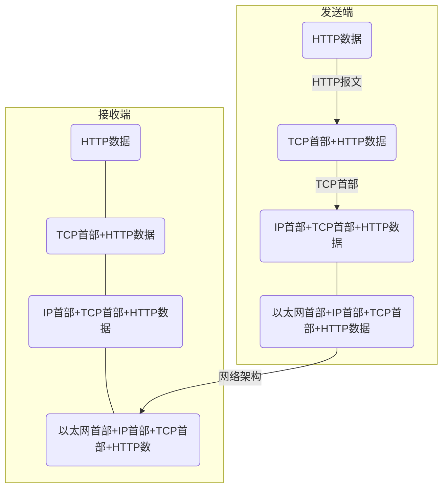
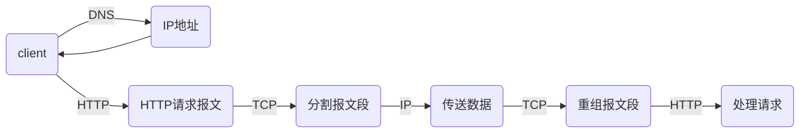

# 图解HTTP
【日】上野宣 著， 于均良 译

---
## 了解Web及网络基础
通常使用的网络是在TCP/IP协议族的基础上运作的，而HTTP属于它内部的一个子集。
### 协议
计算机与网络设备要相互通信，双方就必须基于相同的方法。不同的硬件、操作系统之间的通信，所有的这一切都需要一种规则，称为协议。
#### TCP/IP协议族
把与互联网向关联的协议集合起来总称为TCP/IP。  
TCP/IP采取的是分层管理，共分为四层，自上而下分别是：
- 应用层：决定了向用户提供应用服务时的活动，包括FTP(File Transfer Protocol 文件传输协议)、DNS(Domain Name System 域名系统)、HTTP(HyperText Transfer Protocol 超文本转移协议)。
- 传输层：对上层应用层，提供处于网络连接中的两台计算机之间的数据传输，包括TCP(Transmission Control Protocol 传输控制协议)、UDP(User Data Protocol 用户数据报协议)。
- 网络层：用来处理在网络上流动的数据包(数据包是网络传输的最小单位)，该层规定了通过怎样的路径到达对方计算机，并把数据包传送给对方，包括IP(Internet Protocol 网际协议)。
- 数据链路层：用来处理连接网络的硬件部分，包括操作控制系统、硬件的设备驱动、NIC(Network Interface Card 网络适配器)、光纤等。

层次化的好处：层次间的联系(接口)规定好以后，所有的改动在层内就可以完成，使改动变得自由灵活。
#### TCP/IP通信数据流
- 发送端(客户端)在应用层发出想看某个页面的HTTP请求。
- 在传输层把从应用层收到的数据(HTTP数据报文)进行分割，在各个报文上打上标记序号及端口号(TCP首部)转发给网络层。
- 在网络层增加作为通信目的地的MAC地址(IP首部)后转发给链路层。
- 接收端(服务器)在链路层接收到数据，逐层往上发送，一直到应用层。

发送端逐层增加首部(封装)，接收端逐层删除首部。
#### 与HTTP关系密切的协议：IP、TCP、DN
- IP：作用是把各种数据包传送给对方，在这过程中需要满足各类条件，其中最重要的两个是IP地址和MAC地址。
  + IP地址：指明了节点被分配到的地址，是可变换的。
  + MAC地址：指网卡所属的固定地址，基本上不会更改。
```
IP间的通信主要依赖MAC地址，而通信请求时通常提供的是IP地址，所以需要根据IP地址获得对应的MAC地址，而将IP地址解析成MAC地址需要采用ARP(Address Resolution Protocol)协议。  
在实际的通信过程中，发送端和接收端之间通常不是直接通信的，而是要通过若干个路由器实现通信，而对于发送端和路由器来说，并不需要知道如何到达接收端，而只需要知道需要传输数据时送到哪里(下一跳地址)即可，不需要知道整个网络的情况就可以实现传输，这个过程就叫做路由选择(类似于快递运输的过程)。
```
- TCP：提供可靠的字节流服务，即将大数据进行一定规则的分割以方便传输，且传输过程遵循一定的流程以保证安全可靠。通常选择三次握手策略。
```
三次握手策略是通过两个标志实现的：SYN(synchronize)和ACK(acknowledgement)。  
基本思想是：对于发送接收双方来说，都需要向对方发送一次SYN，也都需要对对方发过来的SYN予以ACK回应，只有当双方都接收到来自对方的ACK时，说明双方之间的通信没有阻碍或断开，此次通信才是安全可靠的。  
具体流程：  
    1.由发送端向接收端发出带有SYN的数据包(请求建立连接)；
    2.接收端接收到并返回带有SYN/ACK的数据包(此时表明接收端可以接受到发送端的数据，要确认返回路径是否完好)；
    3.发送端返回带有ACK的数据包(此时表明发送端可以接受到接收端的数据，说明这是一个可靠的路径)。
```
- DNS：提供域名到IP地址之间的解析服务，或者逆向从IP地址到域名的服务。

#### URI(Uniform Resource Identifier 统一资源标识符)和URL(Uniform Resource Locator 统一资源定位符)
格式：协议方案名:[登录信息(认证)]@服务器地址[:服务器端口号]/带层次的文件路径[?查询字符串][#片段标识符]
## 简单的HTTP协议
HTTP协议用于客户端和服务器端之间，通过请求(客户端)和响应(服务器)的交换达成通信。  
HTTP是不保存状态的实体，即无状态实体。但实际应用中会有需要保存用户状态的情况存在，因此引入了Cookie技术。  
HTTP的实现是依靠URI来完成的。
- 请求报文
  + 方法：GET(获取资源)、POST(传输实体主体)、PUT(传输文件)、HEAD(获得报文首部)、DELETE(删除文件)、OPTIONS(询问支持的方法)、TRACE(追踪路径)、CONNECT(请求用隧道协议连接代理)
  + URI
  + 协议版本
  + 请求首部字段
  + 内容实体
- 响应报文
  + 协议版本
  + 状态码
  + 状态码的原因短语
  + 响应首部字段
  + 主体
### HTTP连接
早期的HTTP连接针对的都是小文件，所以一次请求响应就可以断开连接，但是随着互联网的发展，文件变得越来越大，一次请求响应断开连接并不能满足所有的传输需求，多次连接断开又会增加通信量的开销。  
因此HTTP/1.1采取了**持久连接**的方法，即连接建立后将HTTP请求响应完了再断开。  
在持久连接的基础上，又增加了**管线化**的方式，不需要等到上一次HTTP请求被响应了再开始下一次请求，而是可以同时并行的发送多个请求，效率更高。
### Cookie状态管理
Cookie技术可以通过在请求响应报文中写入Cookie信息来控制客户端状态。
- 客户端没有保存的Cookie时，请求报文中就不会含有Cookie信息，服务器对没有Cookie信息的请求自动生成一个Cookie并包含在响应报文中发送回客户端
- 客户端有保存的Cookie时，就会在请求报文中包含Cookie信息，服务器将请求报文中的Cookie与记录的Cookie值进行比对，就能得到之前的登录信息。
## HTTP报文内的HTTP信息
### HTTP报文
用于HTTP协议交互的信息被称为HTTP报文，分为请求报文和响应报文。  
HTTP报文大致可分为报文首部和报文主体，中间由空行划分。
- 报文首部：服务器或客户端需处理的请求或响应的内容及属性；
  + 请求行：包含在请求报文中，告知请求的方法、URI和HTTP版本；
  + 状态行：包含在响应报文中，告知响应结果的状态码、原因短语和HTTP版本；
  + 首部字段：两种报文中都有，告知请求和响应的各种条件和属性，分为请求首部、响应首部、通用首部、实体首部；
  + 其他，比如Cookie等。
- 空行：由CR(Carriage Return 回车符)+LF(Line Feed 换行符)组成；
- 报文主体：应被发送的数据，可以没有。
### 编码
通过在传输时对数据进行编码压缩，可以有效地处理大量的访问请求，从而提升传输速率。
- 内容编码；
- 分块传输编码。
### 多部分对象集合
用来容纳多份不同对象的集合。
### 范围请求
在传输的过程，如果因为某些原因而导致传输中断时，需要提供一种可恢复的机制，避免从头开始，这便是范围请求。
### 内容协商
针对不同的客户端，要能够选择出最适合客户的资源内容，才能给用户提供更优质的服务，因此需要进行内容协商，主要包括：
- 服务器驱动协商；
- 客户端驱动协商；
- 透明协商。
## 返回结果的HTTP状态码
状态码可以告知客户端服务器是否正常处理了请求，如果没有也会让用户知道大概是发生了什么类型的错误(虽然有时候也不准确)。
|状态码首位|类别|原因短语|
|:-------:|:--:|:-----:|
|1|Informational(信息性状态码)|接受的请求正在处理|
|2|Success(成功状态码)|请求正常处理完毕|
|3|Redirection(重定向状态码)|需要进行附加操作以完成请求|
|4|Client Error(客户端错误状态码)|服务器无法处理请求|
|5|Server Error(服务器错误状态码)|服务器处理请求出错|
常见14种状态码：
- 200 OK
- 204 No Content
- 206 Partial Content
- 301 Movec Permanently
- 302 Found
- 303 See Other
- 304 Not Modified
- 307 Temporary Redirect
- 400 Bad Request
- 401 Unauthorized
- 403 Forbidden
- 404 Not Found
- 500 Internal Server Error
- 503 Service Unavailable
## 与HTTP协作的Web服务器
### 虚拟主机
虚拟主机，又称虚拟服务器，是指在一个实际的服务器上(物理服务器)托管多个域名，减少物理资源的浪费。
### 转发程序
用于通信数据的转发，在客户端和源服务器中间起到桥梁的作用。客户端发送的HTTP请求先经过转发程序，经过处理后再发送给下一个转发程序或到源程序。包括：
- 代理：作为客户端和源服务器之间的中间人，可以利用缓存减少流量消耗，实现访问控制等；
- 网关：可以将HTTP请求转变为非HTTP请求，提高安全性；
- 隧道：确保客户端能与服务器进行安全的通信。
### 缓存
通过在客户端或代理服务器保存资源副本减少流量的消耗，加快通信的时间。只要在副本的有效期限内，客户端访问同一网站资源时就可以直接在本地(客户端缓存)或者在代理服务器获取资源。
## HTTP首部
首部字段结构：
```
首部字段名: 字段值[, 字段值]*
```
- 端到端首部(End-To-End Header)：转发给请求/响应的最终接收目标，且必须保存在由缓存生成的响应中，另外规定必须被转发；
- 逐跳首部(Hop-By-Hop Header)：只对单次转发有效，会因通过缓存或代理而不再转发。只有8个：
  + Connection
  + Keep-Alive
  + Proxy-Authenticate
  + Proxy-Authorization
  + Trailer
  + TE
  + Transfer-Encoding
  + Upgrade
- 为Cookie服务的首部字段
- 其他首部字段
## 确保Web安全的HTTPS
## 确认访问用户身份的认证
## 基于HTTP的功能追加协议
## 构建Web内容的技术
## Web的攻击技术