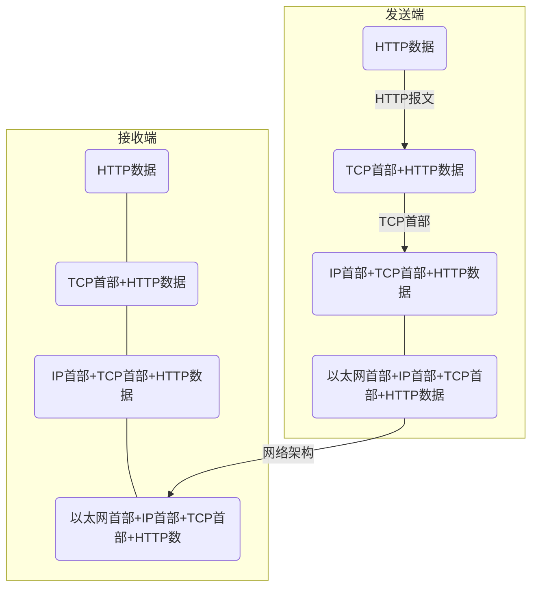
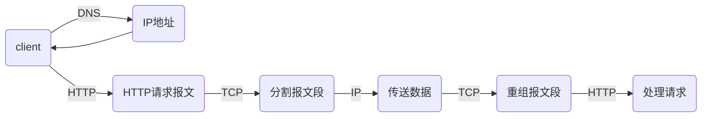
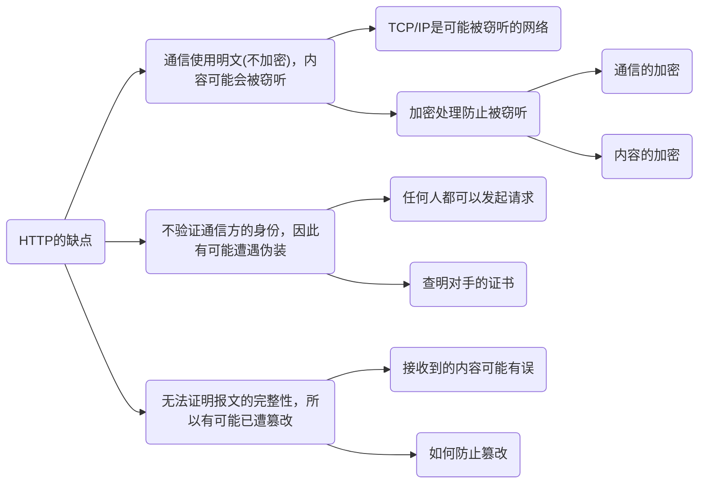

# 图解HTTP
【日】上野宣 著

---
## 了解Web及网络基础
&emsp;&emsp;通常使用的网络是在TCP/IP协议族的基础上运作的，而HTTP属于它内部的一个子集。
### 协议
&emsp;&emsp;计算机与网络设备要相互通信，双方就必须基于相同的方法。不同的硬件、操作系统之间的通信，所有的这一切都需要一种规则，称为协议。
#### TCP/IP协议族
&emsp;&emsp;把与互联网向关联的协议集合起来总称为TCP/IP。  
&emsp;&emsp;TCP/IP采取的是分层管理，共分为四层，自上而下分别是：
- 应用层：决定了向用户提供应用服务时的活动，包括FTP(File Transfer Protocol 文件传输协议)、DNS(Domain Name System 域名系统)、HTTP(HyperText Transfer Protocol 超文本转移协议)。
- 传输层：对上层应用层，提供处于网络连接中的两台计算机之间的数据传输，包括TCP(Transmission Control Protocol 传输控制协议)、UDP(User Data Protocol 用户数据报协议)。
- 网络层：用来处理在网络上流动的数据包(数据包是网络传输的最小单位)，该层规定了通过怎样的路径到达对方计算机，并把数据包传送给对方，包括IP(Internet Protocol 网际协议)。
- 数据链路层：用来处理连接网络的硬件部分，包括操作控制系统、硬件的设备驱动、NIC(Network Interface Card 网络适配器)、光纤等。

&emsp;&emsp;层次化的好处：层次间的联系(接口)规定好以后，所有的改动在层内就可以完成，使改动变得自由灵活。
#### TCP/IP通信数据流
- 发送端(客户端)在应用层发出想看某个页面的HTTP请求。
- 在传输层把从应用层收到的数据(HTTP数据报文)进行分割，在各个报文上打上标记序号及端口号(TCP首部)转发给网络层。
- 在网络层增加作为通信目的地的MAC地址(IP首部)后转发给链路层。
- 接收端(服务器)在链路层接收到数据，逐层往上发送，一直到应用层。

&emsp;&emsp;发送端逐层增加首部(封装)，接收端逐层删除首部。
#### 与HTTP关系密切的协议：IP、TCP、DN
- IP：作用是把各种数据包传送给对方，在这过程中需要满足各类条件，其中最重要的两个是IP地址和MAC地址。
  + IP地址：指明了节点被分配到的地址，是可变换的。
  + MAC地址：指网卡所属的固定地址，基本上不会更改。
```
    IP间的通信主要依赖MAC地址，而通信请求时通常提供的是IP地址，所以需要根据IP地址获得对应的MAC地址，而将IP地址解析成MAC地址需要采用ARP(Address Resolution Protocol)协议。  
    在实际的通信过程中，发送端和接收端之间通常不是直接通信的，而是要通过若干个路由器实现通信，而对于发送端和路由器来说，并不需要知道如何到达接收端，而只需要知道需要传输数据时送到哪里(下一跳地址)即可，不需要知道整个网络的情况就可以实现传输，这个过程就叫做路由选择(类似于快递运输的过程)。
```
- TCP：提供可靠的字节流服务，即将大数据进行一定规则的分割以方便传输，且传输过程遵循一定的流程以保证安全可靠。通常选择三次握手策略。
```
    三次握手策略是通过两个标志实现的：SYN(synchronize)和ACK(acknowledgement)。  
    基本思想是：对于发送接收双方来说，都需要向对方发送一次SYN，也都需要对对方发过来的SYN予以ACK回应，只有当双方都接收到来自对方的ACK时，说明双方之间的通信没有阻碍或断开，此次通信才是安全可靠的。  
    具体流程：  
    1.由发送端向接收端发出带有SYN的数据包(请求建立连接)；
    2.接收端接收到并返回带有SYN/ACK的数据包(此时表明接收端可以接受到发送端的数据，要确认返回路径是否完好)；
    3.发送端返回带有ACK的数据包(此时表明发送端可以接受到接收端的数据，说明这是一个可靠的路径)。
```
- DNS：提供域名到IP地址之间的解析服务，或者逆向从IP地址到域名的服务。

#### URI(Uniform Resource Identifier 统一资源标识符)和URL(Uniform Resource Locator 统一资源定位符)
&emsp;&emsp;格式：协议方案名:[登录信息(认证)]@服务器地址[:服务器端口号]/带层次的文件路径[?查询字符串][#片段标识符]
## 简单的HTTP协议
&emsp;&emsp;HTTP协议用于客户端和服务器端之间，通过请求(客户端)和响应(服务器)的交换达成通信。  
&emsp;&emsp;HTTP是不保存状态的实体，即无状态实体。但实际应用中会有需要保存用户状态的情况存在，因此引入了Cookie技术。  
&emsp;&emsp;HTTP的实现是依靠URI来完成的。
- 请求报文
  + 方法：GET(获取资源)、POST(传输实体主体)、PUT(传输文件)、HEAD(获得报文首部)、DELETE(删除文件)、OPTIONS(询问支持的方法)、TRACE(追踪路径)、CONNECT(请求用隧道协议连接代理)
  + URI
  + 协议版本
  + 请求首部字段
  + 内容实体
- 响应报文
  + 协议版本
  + 状态码
  + 状态码的原因短语
  + 响应首部字段
  + 主体
### HTTP连接
&emsp;&emsp;早期的HTTP连接针对的都是小文件，所以一次请求响应就可以断开连接，但是随着互联网的发展，文件变得越来越大，一次请求响应断开连接并不能满足所有的传输需求，多次连接断开又会增加通信量的开销。  
&emsp;&emsp;因此HTTP/1.1采取了**持久连接**的方法，即连接建立后将HTTP请求响应完了再断开。  
&emsp;&emsp;在持久连接的基础上，又增加了**管线化**的方式，不需要等到上一次HTTP请求被响应了再开始下一次请求，而是可以同时并行的发送多个请求，效率更高。
### Cookie状态管理
&emsp;&emsp;Cookie技术可以通过在请求响应报文中写入Cookie信息来控制客户端状态。
- 客户端没有保存的Cookie时，请求报文中就不会含有Cookie信息，服务器对没有Cookie信息的请求自动生成一个Cookie并包含在响应报文中发送回客户端
- 客户端有保存的Cookie时，就会在请求报文中包含Cookie信息，服务器将请求报文中的Cookie与记录的Cookie值进行比对，就能得到之前的登录信息。
## HTTP报文内的HTTP信息
### HTTP报文
&emsp;&emsp;用于HTTP协议交互的信息被称为HTTP报文，分为请求报文和响应报文。  
&emsp;&emsp;HTTP报文大致可分为报文首部和报文主体，中间由空行划分。
- 报文首部：服务器或客户端需处理的请求或响应的内容及属性；
  + 请求行：包含在请求报文中，告知请求的方法、URI和HTTP版本；
  + 状态行：包含在响应报文中，告知响应结果的状态码、原因短语和HTTP版本；
  + 首部字段：两种报文中都有，告知请求和响应的各种条件和属性，分为请求首部、响应首部、通用首部、实体首部；
  + 其他，比如Cookie等。
- 空行：由CR(Carriage Return 回车符)+LF(Line Feed 换行符)组成；
- 报文主体：应被发送的数据，可以没有。
### 编码
&emsp;&emsp;通过在传输时对数据进行编码压缩，可以有效地处理大量的访问请求，从而提升传输速率。
- 内容编码；
- 分块传输编码。
### 多部分对象集合
&emsp;&emsp;用来容纳多份不同对象的集合。
### 范围请求
&emsp;&emsp;在传输的过程，如果因为某些原因而导致传输中断时，需要提供一种可恢复的机制，避免从头开始，这便是范围请求。
### 内容协商
&emsp;&emsp;针对不同的客户端，要能够选择出最适合客户的资源内容，才能给用户提供更优质的服务，因此需要进行内容协商，主要包括：
- 服务器驱动协商；
- 客户端驱动协商；
- 透明协商。
## 返回结果的HTTP状态码
&emsp;&emsp;状态码可以告知客户端服务器是否正常处理了请求，如果没有也会让用户知道大概是发生了什么类型的错误(虽然有时候也不准确)。
|状态码首位|类别|原因短语|
|:-------:|:--:|:-----:|
|1|Informational(信息性状态码)|接受的请求正在处理|
|2|Success(成功状态码)|请求正常处理完毕|
|3|Redirection(重定向状态码)|需要进行附加操作以完成请求|
|4|Client Error(客户端错误状态码)|服务器无法处理请求|
|5|Server Error(服务器错误状态码)|服务器处理请求出错|
常见14种状态码：
- 200 OK
- 204 No Content
- 206 Partial Content
- 301 Movec Permanently
- 302 Found
- 303 See Other
- 304 Not Modified
- 307 Temporary Redirect
- 400 Bad Request
- 401 Unauthorized
- 403 Forbidden
- 404 Not Found
- 500 Internal Server Error
- 503 Service Unavailable
## 与HTTP协作的Web服务器
### 虚拟主机
&emsp;&emsp;虚拟主机，又称虚拟服务器，是指在一个实际的服务器上(物理服务器)托管多个域名，减少物理资源的浪费。
### 转发程序
&emsp;&emsp;用于通信数据的转发，在客户端和源服务器中间起到桥梁的作用。客户端发送的HTTP请求先经过转发程序，经过处理后再发送给下一个转发程序或到源程序。包括：
- 代理：作为客户端和源服务器之间的中间人，可以利用缓存减少流量消耗，实现访问控制等；
- 网关：可以将HTTP请求转变为非HTTP请求，提高安全性；
- 隧道：确保客户端能与服务器进行安全的通信。
### 缓存
&emsp;&emsp;通过在客户端或代理服务器保存资源副本减少流量的消耗，加快通信的时间。只要在副本的有效期限内，客户端访问同一网站资源时就可以直接在本地(客户端缓存)或者在代理服务器获取资源。
## HTTP首部
&emsp;&emsp;首部字段结构：
```
首部字段名: 字段值[, 字段值]*
```
- 端到端首部(End-To-End Header)：转发给请求/响应的最终接收目标，且必须保存在由缓存生成的响应中，另外规定必须被转发；
- 逐跳首部(Hop-By-Hop Header)：只对单次转发有效，会因通过缓存或代理而不再转发。只有8个：
  + Connection
  + Keep-Alive
  + Proxy-Authenticate
  + Proxy-Authorization
  + Trailer
  + TE
  + Transfer-Encoding
  + Upgrade
- 为Cookie服务的首部字段
- 其他首部字段
## 确保Web安全的HTTPS

&emsp;&emsp;基于HTTP的无法改变的缺点(HTTP本身的便利性使得它不去做过多的检查，而是专注于保证传输本身的有效)，为了保证客户端及服务器传输过程的安全性，需要在HTTP基础上加上加密处理、认证以及完整性保护，于是就诞生了HTTPS。  
&emsp;&emsp;HTTPS并非一种新的协议，而是加上SSL(Secure Socket Layer)和TLS(Transport Layer Security)的HTTP，即在与TCP通信之前先经过SSL，用以保证安全。
### 加密
- 共享密钥加密：也称对称密钥加密，是指加密解密使用同一个密钥的方法，此时在传输过程中就必须将密钥一起传输给对方，所以一旦被攻击者窃听到，该加密方法就失去了它的作用。
- 公开密钥加密：也称非对称密钥加密，是指加密过程采用一个密钥(公开密钥)，解密过程采用另一个密钥(私有密钥)，二者一般有一定算数关系但一般数值较大，计算难度比较大。传输时仅将公开密钥传输给对方，对方接收到数据之后用私有密钥进行解密，从而提高了安全性。
HTTP一般采用混合加密机制，即在确保安全的情况下采用速度较快的共享密钥加密，在不确定是否安全甚至不安全的情况下采用安全性高的公开密钥加密。
### 证书
&emsp;&emsp;但是公开密钥加密仍然有自己的不足，就是公开的密钥有被篡改或被替换掉的风险，为此需要增加一道验证机制，给公开密钥增加数字证书。  
&emsp;&emsp;数字证书一般由客户端与服务器双方认证的数字证书认证机构颁发，以保持中立立场。  
&emsp;&emsp;先由服务器将公开密钥发送给机构，机构生成数字证书之后与密钥一起发送给客户端，客户端通过机构提供的密钥验证公开密钥的正确性，验证安全后再进行公开密钥传输。  
### HTTPS安全通信机制
- 步骤1：客户端通过发送Client Hello报文开始SSL通信；
- 步骤2：服务器可进行SSL通信时，会以Server Hello报文作为应答；
- 步骤3：服务器发送Certificate报文；
- 步骤4：服务器发送Server Hello Done报文通知客户端(最初阶段的SSL握手协商部分结束)；
- 步骤5：客户端以Client Key Exchange报文作为回应；
- 步骤6：客户端发送Change Cipher Spec报文；
- 步骤7：客户端发送Finished报文；
- 步骤8：服务器发送Change Cipher Spec报文；
- 步骤9：服务器发送Finished报文；
- 步骤10：客户端发送HTTP请求(SSL连接建立完成)；
- 步骤11：服务器发送HTTP响应；
- 步骤12：客户端发送close_notify报文(断开连接)；
## 确认访问用户身份的认证
&emsp;&emsp;为了确认访问服务器的人的身份，需要访问者提供证明自己身份的信息，即进行认证。主要可以通过一下信息进行认证：
- 密码；
- 动态令牌；
- 数字证书；
- 生物认证；
- IC卡；
- 等。
&emsp;&emsp;HTTP主要采用的认证方式有：
- BASIC认证：服务器向用户端要求认证(质询)，客户端将认证信息简单加密后发送给服务器(响应)，但因为加密方法太过简单(不存在密钥)，并不常用;
- DIGEST认证：服务器在质询过程中增加随机生成的质询码，客户端响应时返回计算后的响应码，但是安全等级还是不太高，适用范围依然有限;
- SSL客户端认证：事先需要在客户端安装好证书，服务器向客户端询问证书信息，获得客户端返回的证书，经过验证成功后便可进行SSL通信，只不过证书的获得需要付出一定的费用，因此有局限性；
- FormBase认证：由Web应用程序提供，一般通过Cookie进行管理，此认证方法安全性较高，最常被使用。
&emsp;&emsp;因为需要验证用户和客户端的正确性，一般采用SSL客户端认证和FormBase认证并用的双因素认证。
## 基于HTTP的功能追加协议
&emsp;&emsp;互联网高速发展的现在，HTTP协议已经不能很好地满足所有的需求，因此需要新的协议，但是考虑到HTTP的普及性，提出全新的协议并不容易，因此出现了很多基于HTTP的改进协议，当然新协议也在制定中。
- SPDY
  + Ajax
  + Comet
- WebSocket
- HTTP/2.0
- WebDAV
## 构建Web内容的技术
- HTML
- 动态HTML
- Web应用
- 数据发布的格式及语言
## Web的攻击技术
&emsp;&emsp;HTTP因为其本身的简单性，并不具备足够的安全性，对于使用HTTP协议的客户端和服务器来说，通信过程及Web应用极易被攻击者攻击，用以对客户端或服务器实施攻击以破坏通信，亦或是从站点获所需信息。  
&emsp;&emsp;攻击模式：
- 直接攻击：攻击者通过一定手段直接向服务器发起攻击
- 间接攻击：攻击者通过向客户端诱导陷阱的方式间接对服务器造成攻击

&emsp;&emsp;列举常见的攻击方式：
- SQL注入攻击：针对Web应用使用的数据库，通过运行非法的SQL而产生
  + 非法查看或篡改数据库内的数据
  + 规避认证
  + 执行和数据库服务企业无关联的程序
- OS命令注入攻击：通过Web应用执行非法的操作系统命令达到攻击的目的
- XSS跨站脚本攻击：通过存在安全漏洞的Web网站注册用户的浏览器内运行非法的HTML标签或JavaScript
  + 利用虚假输入表单骗取用户个人信息
  + 利用脚本窃取用户的Cookie值，被害者在不知情的情况下，帮助攻击者发送恶意请求
  + 显示伪造的文章或图片
- HTTP首部注入攻击：攻击者通过在响应首部字段内插入换行，添加任意响应字段或主体
  + 设置任何Cookie信息
  + 重定向至任意URL
  + 显示任意的主体
- 邮件首部注入攻击：Web应用中的邮件发送功能，攻击者通过向邮件首部To或Subject内任意添加非法内容发起
- 目录遍历攻击：对本无意公开的文件目录，通过非法截断其目录路径后，达到访问目的
- 远程文件包含漏洞：当部分脚本内容需要从其他文件读入时，攻击者利用指定外部服务器的URL充当依赖文件，让脚本读取之后，就可运行任意脚本。
- 强制浏览：从安置在Web服务器的公开目录下的文件中，浏览那些原本非自愿公开的文件
  + 泄露顾客的个人信息等重要情报
  + 泄漏原本需要具有访问权限的用户才可查阅的信息内容
  + 泄漏未外连到外界的文件
- 不正确的错误消息处理：Web应用的错误信息内包含对攻击者有用的信息
- 开放重定向：通过指定的重定向URL到某个恶意的Web网站
- 会话劫持：攻击者通过某种手段拿到了用户的会话ID，并非法使用此会话ID伪装成用户
- 会话固定攻击：强制用户使用攻击者指定的会话ID
- 跨站点请求伪造：攻击者通过设置好的陷阱，强制对已完成认证的用户进行非预期的个人信息或设定信息等某些状态更新
- 密码破解：算出密码，突破认证
- 点击劫持：利用透明的按钮或链接做成陷阱，，覆盖在Web页面之上，诱使用户在不知情的情况下，点击那个链接访问内容
- DoS(Denial of Service)攻击：让运行中的服务呈停滞状态的攻击
  + 集中利用访问请求造成资源过载，资源用尽的同时，实际上服务也就呈停止状态
  + 通过攻击安全漏洞使服务停止
- 后门程序：开发设置的隐藏入口，可不按正常步骤使用受限功能